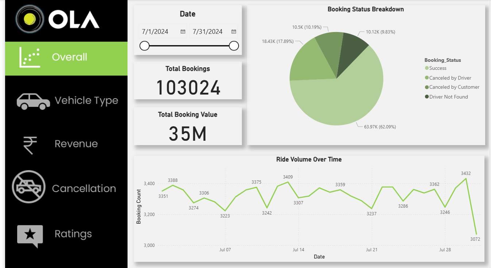
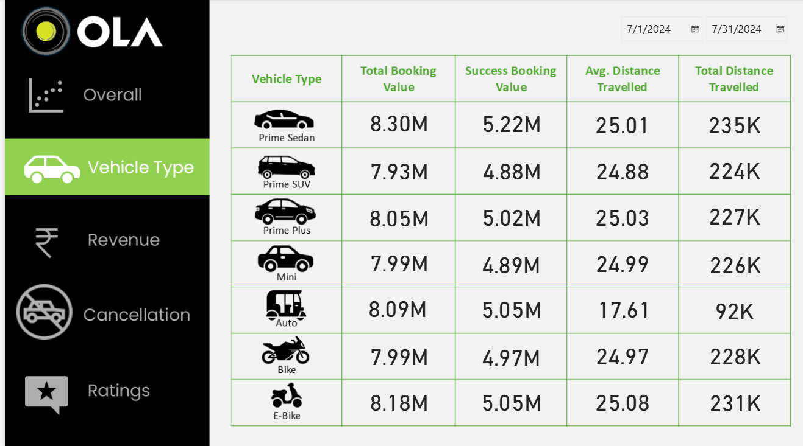
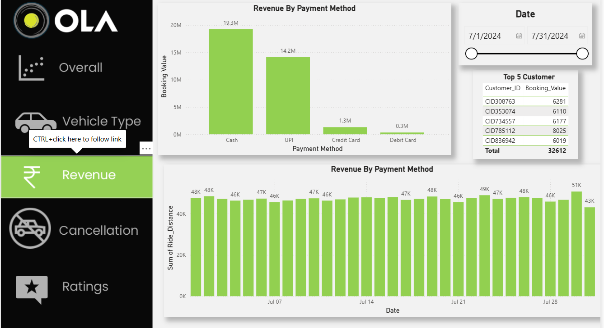
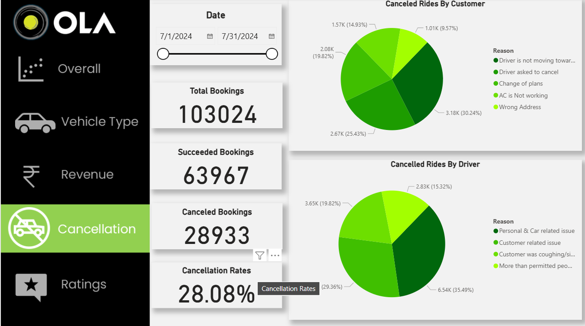
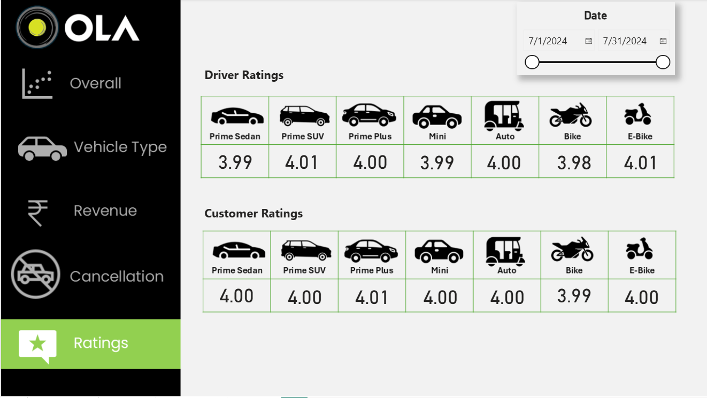

# 🚖 OLA Rides Analytics Dashboard (Power BI)

This repository contains an interactive **Power BI dashboard** built for analyzing ride data from **OLA Cabs**. The dashboard provides insights into bookings, revenue, ride types, and customer satisfaction.

---

## 📸 Dashboard Preview
Here’s a snapshot of the dashboard:  

---

## 🚀 Project Overview
The **OLA Analytics Dashboard** enables business teams to:
- Track total bookings and completed rides
- Analyze revenue trends and driver performance
- Compare ride types (Mini, Micro, Prime, etc.)
- Evaluate customer satisfaction and ratings
- Monitor peak booking hours and popular routes

---

## 🛠️ Tools & Technologies
- **Power BI Desktop** – Data visualization
- **Excel/CSV (source dataset)** – Pre-processed ride data
- **DAX** – Used for KPIs, custom measures, and time intelligence

---

## 📌 Key Insights
- Ride booking trends by date, time, and geography
- Customer preferences for ride types
- Revenue per ride and overall profitability
- Driver performance metrics
- Ratings and feedback analysis

---

## Project Snapshots
1. Vehicle Type :

2.Revenue : 

3.Cancellation : 

4.Ratings : 

